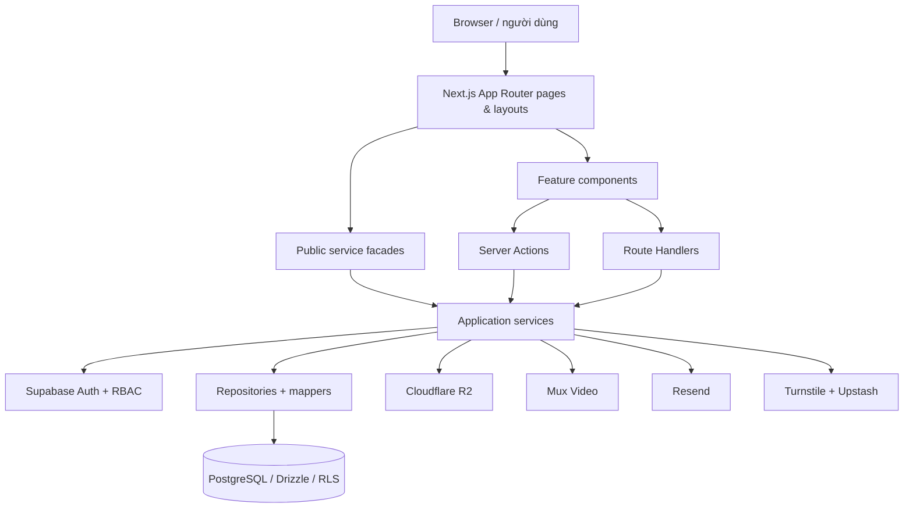

# System map

> Generated artifact — source fingerprint: `8252c88eef46471c254b01d8b5d8224d2f9e547cf7019f773dc7147e06d07749`

## Snapshot

- 313 file source/config đã quét, 62,470 dòng.
- 25 page route.
- 5 Route Handler.
- 2 metadata route.
- 71 module component, 48 Client Component.
- 19 bảng PostgreSQL, 15 enum.
- 34 biến môi trường được khai báo hoặc tham chiếu.

## Bản đồ kiến trúc

## Feature ownership

| Feature | Route | Source chính |
| --- | --- | --- |
| Site shell & homepage | / | src/app/page.tsx, src/app/layout.tsx, src/components/home, src/components/layout |
| Blog & taxonomy | /blog, /blog/[slug] | src/components/blog, src/server/services/posts.service.ts, taxonomies.service.ts |
| Video | /videos | src/components/videos, src/server/services/videos.service.ts, src/server/video |
| Gallery & media | /gallery, /admin/gallery | src/components/gallery, src/server/services/gallery.service.ts, media.service.ts |
| Events | /events, /events/[slug] | src/components/events, src/server/services/events.service.ts |
| Campaigns | /campaigns, /campaigns/[slug] | src/components/campaigns, src/server/services/campaigns.service.ts |
| Contact, newsletter & submissions | /contact, /newsletter/unsubscribe, /admin/submissions | src/components/contact, src/server/services/submissions.service.ts |
| Authentication & RBAC | /admin/login, /auth/callback | src/server/auth, src/server/supabase, src/proxy.ts |
| Admin CMS & settings | /admin/** | src/components/admin, src/actions, src/server/services/settings.service.ts |
| Analytics | /api/analytics/events, /admin | src/components/analytics, src/lib/analytics.ts, src/server/services/analytics.service.ts |
| SEO, legal & platform security | /privacy, /terms, /sitemap.xml, /robots.txt | src/lib/metadata.ts, next.config.ts, src/config/security.config.ts |

## Boundary phải giữ

- Page/layout ưu tiên là Server Component; chỉ thêm `"use client"` ở interaction boundary.
- UI không gọi repository hoặc database trực tiếp.
- Mutation từ UI đi qua `src/actions`; HTTP/webhook boundary đi qua `src/app/**/route.ts`.
- Service chứa nghiệp vụ, authorization và validation; repository chỉ truy cập Drizzle.
- Mapper chuyển database row thành DTO ổn định cho FE.
- Public content đi qua `src/services/*` facade để giữ khả năng chuyển `USE_DATABASE_CONTENT` giữa mock và database.
- Server-only secret không được đưa vào biến `NEXT_PUBLIC_*`.

## Quy tắc tránh code trùng

1. Tra component có sẵn trong [COMPONENTS.md](./COMPONENTS.md), đặc biệt `common`, `admin`, picker/table/modal.
2. Tra export service/action trong [BACKEND.md](./BACKEND.md); không tạo đường truy cập DB thứ hai cho cùng nghiệp vụ.
3. Tra type trong `src/types`, validation trong `src/server/validation`, config trong `src/config`.
4. Kiểm tra “Imported by” trong [SOURCE_INDEX.md](./SOURCE_INDEX.md) trước khi đổi contract.
5. Đọc feature doc trước khi sửa và cập nhật file đó ngay trong cùng thay đổi.
6. Feature mới phải có file riêng trong `docs/features`, được thêm vào mục lục và feature ownership.
7. Sau lần sửa source/config cuối cùng, chạy `npm run ai:setup`; chỉ hoàn tất khi `npm run ai:check` pass.
